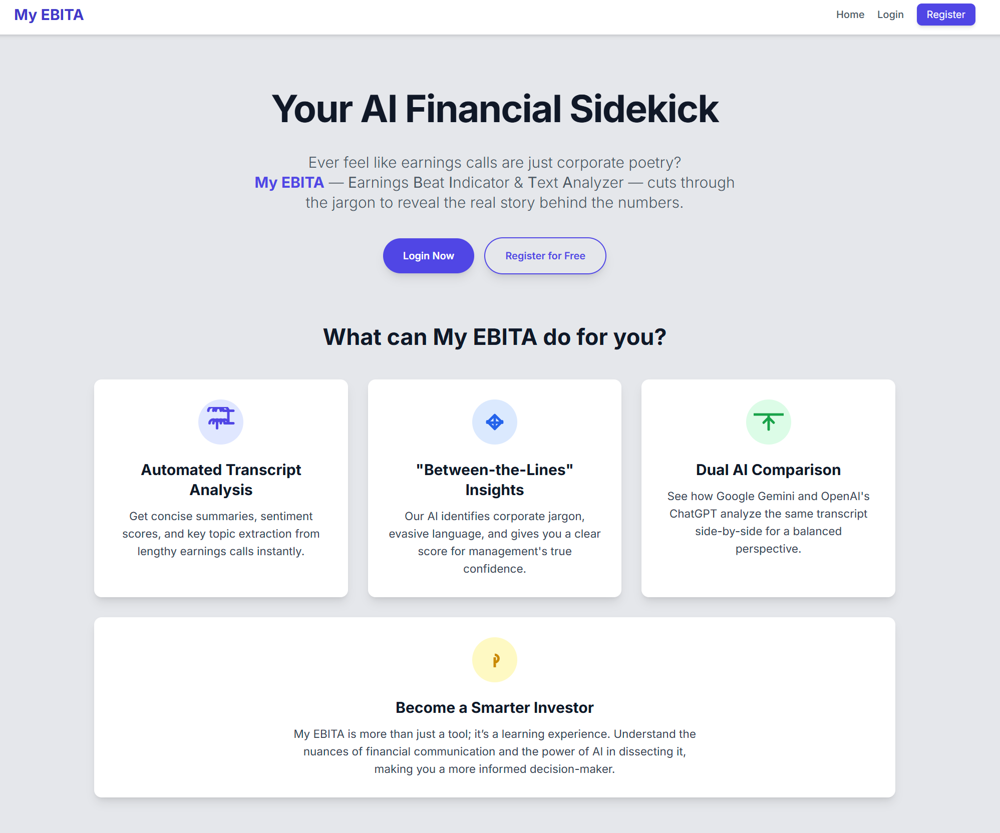

# My EBITA

An AI Financial Sidekick. My EBITA stands for Earnings Beat Indicator & Text Analyzer.

This application is designed for the discerning investor who wants to look past the numbers. It provides a simple, clean interface to acquire earnings call transcripts and run a dual analysis using both Gemini and ChatGPT. The goal is to provide a comprehensive, "between-the-lines" look at management sentiment, confidence, and potential red flags, all on a single, easy-to-read report.



## Installation

To install this app, simply clone the repository and install the dependencies in requirements.txt using `pip`

```bash
   pip install -r requirements.txt
```
You'll also need to configure your API keys for the AI models and the data acquisition service in a .env file.

## Usage

_The app is currently a local Flask application, not publicly deployed._

**TODO URL if deployed**

To use this app, run the following command `python app.py`
> - The app supports multiple users with individual analysis reports. You will be prompted to log in or register a new account.
> - The core of the app is the Dashboard, where you can acquire new earnings call transcripts and run your analysis.

Acquiring a Transcript
> - On the dashboard, enter a Ticker Symbol, Fiscal Year, and Fiscal Quarter. The app will fetch the transcript from the API Ninjas service.
> - If a transcript already exists, you will be notified and can proceed to analysis.
> - Transcripts are stored and can be viewed or deleted from the dashboard.

Running an AI Analysis
> - Once a transcript is acquired, enter its Transcript ID into the "Analyze Transcript" form.
> - The app will then send the transcript to ChatGPT, Gemini and Groq for a triple AI analysis. The result is a single, comparative report.
> - Analysis reports are stored per user and can be viewed or deleted from the dashboard.

## Project Status

As of _29-AUG-2025_, project is: _MVP_

## API Documentation

Interactive API documentation is available at `/api/docs` when running the application locally.

The API provides comprehensive endpoints for:
- **Authentication** - User login, logout, and registration
- **Transcripts** - Fetch, retrieve, and delete earnings call transcripts
- **Analysis** - Run AI analysis and manage reports
- **Chatbot** - Conversational AI with conversation history
- **User** - Profile and statistics management

### Key Endpoints

- `POST /api/v1/transcripts/fetch` - Fetch new transcript
- `POST /api/v1/analysis/run` - Run AI analysis
- `POST /api/v1/chat` - Chat with AI assistant (20 req/min)
- `GET /api/v1/chat/history/{id}` - Download conversation history
- `POST /api/v1/chat/clear/{id}` - Clear conversation (10 req/hour)

All endpoints require authentication except `/login` and `/register`.

## Room for Improvement

As of _23-OCT-2025_, project is: _MVP with API Documentation_

✅ app.py & frontend updates
✅ pydantic_ai agent bot
✅ user profile page
✅ download report feature
✅ Log and API limits
✅ API Docs
-> LangFuse integration
-> Presentation

## Acknowledgements

A special thanks to the entire team at Masterschool, and especially to my AI Mentor Zisis Batzos, for providing the guidance (and the patience) in building this app.

## Contributing

I welcome any contributions! If you'd like to contribute to this project, please reach out to [email@edgroell.com](mailto:email@edgroell.com)